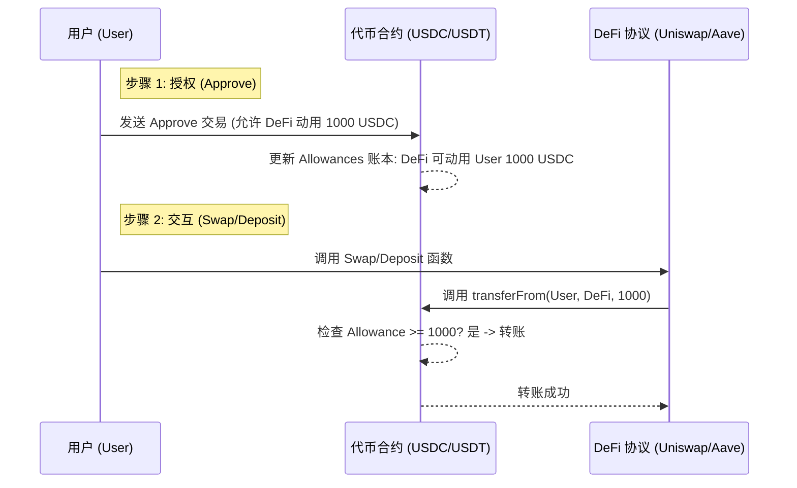
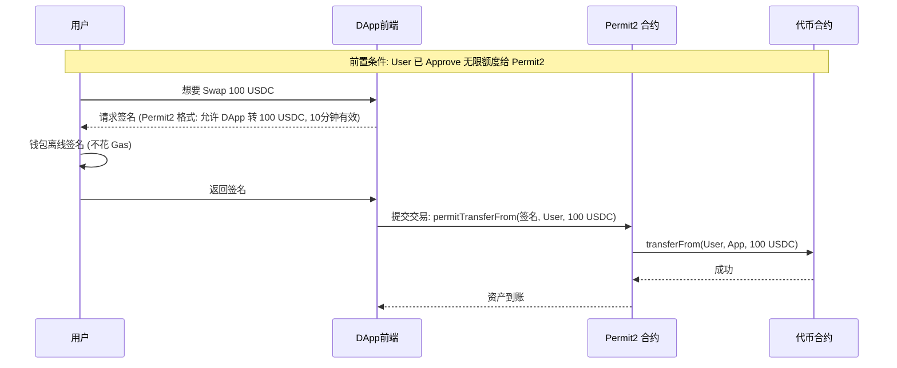

# 你的资产真的安全吗？从 EspressoSys 创始人被盗谈起

EspressoSys 联合创始人的钱包被盗，损失惨重。原因既令人惋惜又发人深省：几个月前，她在测试某个合约时，即使交互金额仅有 **5 USDC**，却给予了该合约 **无限授权 (Infinite Approval)**。

当该测试合约后来被发现存在漏洞时，攻击者利用这些“历史遗留的无限授权”，直接从已授权用户的钱包中转走了资产。你早已忘记的一次测试授权，可能在未来某一天，成为黑客搬空你钱包的后门。

这引出了一个核心问题：**我们在点击钱包上的“确认”时，到底发生了什么？**

## 1. 授权 (Approve) 到底是什么？

在以太坊和 EVM 兼容链上，处理 ERC-20 代币（如 USDC, USDT, UNI）时，有一个独特的机制叫 **Approve（授权）**。

### 为什么需要授权？
ETH 是原生资产，转账时直接携带价值，就像原本就在信封里的现金。但在智能合约的世界里，ERC-20 代币只是合约账本上的一个数字。当你想要在一个去中心化交易所 (DEX) 交易，或者在借贷协议中存款时，你不能直接把币“推”给合约，而是需要先告诉代币合约：“我允许这个 DEX 合约从我的账户里拿走多少钱”。

### 授权 vs 转账
- **转账 (Transfer)**: 你主动发起，把代币发送给别人。需私钥签名。
- **授权 (Approve) + 调用 (TransferFrom)**: 你先签署一个授权交易，允许通过验证的第三方合约（Spender）在未来随时从你的账户里“拉取”代币。

### 风险点：无限授权
为了用户体验，很多早期的 DeFi 协议（甚至现在的习惯）会引导用户进行 **无限授权 (Infinite Approval)**。
这意味着你告诉代币合约：“我允许这个协议转走我 **无限多** 的代币”。
- **好处**：省 Gas，以后再交互不用重复授权。
- **坏处**：如果该协议合约存在漏洞被黑客控制，或者项目方作恶，他们可以随时利用这个“无限额度”转走你钱包里该代币的所有余额，而不需要你再次签名。

## 2. 离线签名与 Gasless 授权 (Permit / Permit2)

你可能注意到了，现在的很多新协议不需要你发一笔昂贵的 Approve 交易，而是弹出一个签名框让你签名一段看不懂的文字，这就涉及到 **离线签名 (Off-chain Signing)** 技术。

### 什么是离线签名？
传统的 Approve 是链上交易，需要消耗 Gas。而离线签名（基于 EIP-2612 或 EIP-712）是你用私钥对一段特定的数据（消息）进行签名，这个签名不上链，不花钱。
你把这个签名给协议，协议拿着这个签名去链上帮你在操作的同时完成授权。

### Permit (EIP-2612)
这是代币合约原生支持的功能。
1. 用户在钱包签名一个消息：“我授权 Spender 动用我 X 金额，截止时间 T，签名是 S”。
2. 用户把签名 S 给 Relayer（或者协议前端）。
3. 协议在执行 Swap 时，先调用代币的 `permit()` 函数提交签名。
4. 代币合约验证签名有效，自动修改 Allowance。
5. 协议随后立即调用 `transferFrom` 完成交易。

### Permit2 (Uniswap 推出)
为了解决老代币不支持 Permit 的问题，Uniswap 推出了 Permit2。
- **原理**：用户先给 Permit2 合约一个无限授权（只做一次）。以后所有的交互，都通过离线签名告诉 Permit2：“我允许 Uniswap 这次操作用多少钱”。
- **优势**：
    - **安全性**：虽然你授权给了 Permit2 无限额度，但 Permit2 本身是经过严格审计的基础设施。具体的 DApp 每次只能拿到你“单次签名”的临时额度。
    - **自动过期**：可以设置签名的有效期，过期作废。

## 3. 广播机制与交易上链

当我们在这个过程中提到“广播”时，指的是：
1. **构造交易**：钱包根据你的操作（比如转账、Approve、或者附带签名的 Swap）构造好一串二进制数据。
2. **签名**：你用私钥对这串数据签名，证明是你发起的。
3. **广播 (Broadcast)**：钱包节点把这串带签名的数据发送到区块链的 P2P 网络（Mempool）。
4. **打包**：矿工/验证者从 Mempool 捡起你的交易，验证签名无误，余额足够，然后打包进区块。

**注意**：离线签名本身不广播，它是把“签名数据”作为参数，包含在另一笔由协议（或 Relayer）发起并广播的交易中。

## 4. 安全最佳实践：如何保护你的钱包？

回到开头的故事，我们能学到什么？

1.  **拒绝盲目无限授权**：
    - 在 Metamask / Rabby 等钱包中，当弹出授权窗口时，**手动修改额度**。如果只需要交互 100 U，就只填 100，不要默认给无限。
    - 尤其对于新项目、土狗项目、测试项目，**绝对不要**给无限授权。

2.  **定期体检与撤销 (Revoke)**：
    - 即使是正规项目，授权完如果长期不用，也建议撤销。
    - **工具推荐**：
        - [Revoke.cash](https://revoke.cash/)
        - [DeBank](https://debank.com/)
        - [Rabby Wallet](https://rabby.io/) (内置安全扫描)
    - 养成习惯：每隔几个月，或在重大黑客事件发生后，检查你的授权列表。

3.  **账户隔离**：
    - **主资金钱包 (Vault)**：只存钱，极少交互，只授权给最最顶级的协议（如 Uniswap, Aave 主网），且用完即撤。
    - **Degen 钱包**：存少量资金，专门用来冲土狗、测试新协议。被盗也不心疼。
    - **硬件钱包**：对于大额资产，务必使用硬件钱包，并配合多重签名 (Multisig) 更佳。

4.  **看清签名的内容**：
    - 随着 Permit 的普及，钓鱼攻击也升级了。黑客会伪造一个“登录签名”或者“领空投签名”，实际是一笔 Permit 授权签名。
    - **务必检查**：签名的对象是谁？额度是多少？
    - 如果钱包提示正在签署“Permit”或“SetApprovalForAll”，务必打起十二分精神。

---

**总结**：区块链赋予了你对自己资产的完全掌控权，但同时也赋予了你保卫资产的完全责任。理解 `Approve`、`Signature` 和 `Broadcast` 的底层逻辑，是成为合格 Web3 玩家的第一课。
